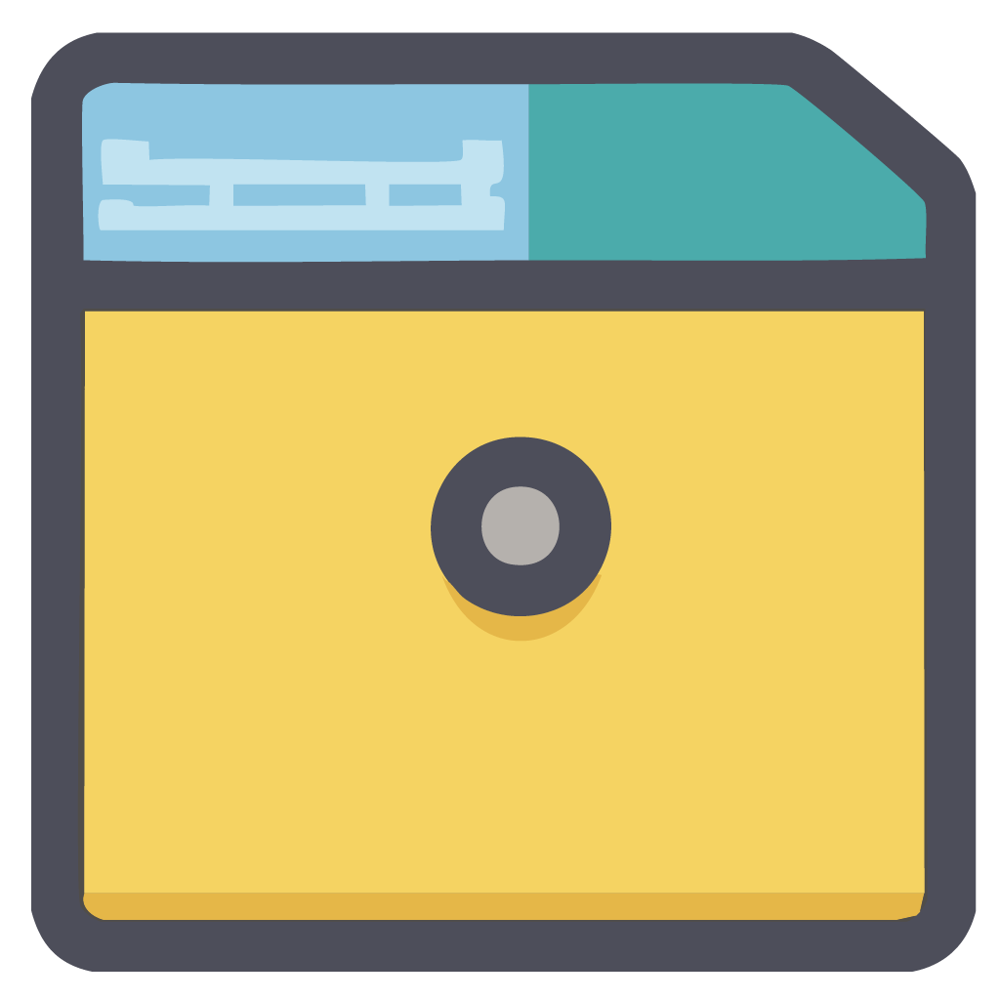

<!-- PROJECT LOGO -->
<br />
<div align="center">
  <a href="https://github.com/Pitiedwzr/FileArchiver">
    
  </a>

<h3 align="center">File Archiver</h3>

![PythonVersion][PythonVersion]
![license][License]
![platform][Platform]

  <p align="center">
    An app that can help you organize your files!
  </p>
</div>


<!-- TABLE OF CONTENTS -->
<details>
  <summary>Table of Contents</summary>
  <ol>
    <li>
      <a href="#about-the-project">About The Project</a>
      <ul>
        <li><a href="#built-with">Built With</a></li>
        <li><a href="#features">Features</a></li>
      </ul>
    </li>
    <li>
      <a href="#getting-started">Getting Started</a>
      <ul>
        <li><a href="#prerequisites">Prerequisites</a></li>
        <li><a href="#installation">Installation</a></li>
      </ul>
    </li>
    <li><a href="#usage">Usage</a></li>
    <li><a href="#roadmap">Roadmap</a></li>
    <li><a href="#license">License</a></li>
    <li><a href="#acknowledgments">Acknowledgments</a></li>
  </ol>
</details>


<!-- ABOUT THE PROJECT -->
## About The Project

<!-- [![Product Name Screen Shot][product-screenshot]](https://example.com) -->

Personally, I've always been too lazy to organize the various files on my computer (school assignments, various projects, etc.), which leads to a lot of time when trying to find a particular file (and not always finding it). Although at the beginning of this year I was well organized with all the new files, the old ones were still very cluttered. It just so happened that one of the digital technology assessments this year was to create a software, so based on this current situation, I decided to work on this app.

### Features

* Automatic sorting of files by specific rules (supports customized rules)
* Snapshots that enable files to be restored to their original state at any time

### Built With

* [![Python][Python]][Python-url]
* [![Qt][Qt]][qt-url]


<!-- GETTING STARTED -->
## Getting Started

To use this app, you can either download the portable version from [Releases][Releases] or build it according to the following steps.

### Prerequisites

Make sure you have python 64-bit installed on your computer

### Installation

1. Clone the repo
   ```sh
   git clone https://github.com/Pitiedwzr/FileArchiver
   ```
2. Install packages
   ```sh
   pip install -r requirements.txt
   ```
3. Use `FileArchiver.py` to run the main program


<!-- USAGE EXAMPLES -->
## Usage

<!-- Use this space to show useful examples of how a project can be used. Additional screenshots, code examples and demos work well in this space. You may also link to more resources. -->
<!-- Wait for the real program -->


<!-- ROADMAP -->
## Roadmap

- [x] ~~Connect CategoriesFiles function to gui~~
- [x] ~~Package code into exe with GitHub Action~~
- [ ] Snapshot
- [ ] Internalization (i18n)
- [ ] Tidy up naming
- [ ] Refactor
- [ ] Support documents

See the [Backlog][Backlog] for more information.


<!-- LICENSE -->
## License

Distributed under the LGPL License. See `LICENSE.txt` for more information.


<!-- ACKNOWLEDGMENTS -->
## Acknowledgments

* [Best README Template](https://github.com/othneildrew/Best-README-Template)


<!-- MARKDOWN LINKS & IMAGES -->
<!-- https://www.markdownguide.org/basic-syntax/#reference-style-links -->
[License]: https://img.shields.io/github/license/Pitiedwzr/FileArchiver
[Platform]: https://img.shields.io/badge/platform-Windows%20%7C%20macOS%20%7C%20Linux-green
[PythonVersion]: https://img.shields.io/badge/Python-3.10-3776AB?logo=python&logoColor=f5f5f5
[product-screenshot]: resource/images/screenshot.png
[Python]: https://img.shields.io/badge/Python-3776AB?style=for-the-badge&logo=python&logoColor=white
[Python-url]: https://python.org/
[Qt]: https://img.shields.io/badge/Qt-41CD52?style=for-the-badge&logo=qt&logoColor=white
[Qt-url]: https://qt.io/
[Releases]: https://github.com/Pitiedwzr/FileArchiver/releases
[Backlog]: https://github.com/users/Pitiedwzr/projects/1/views/1
